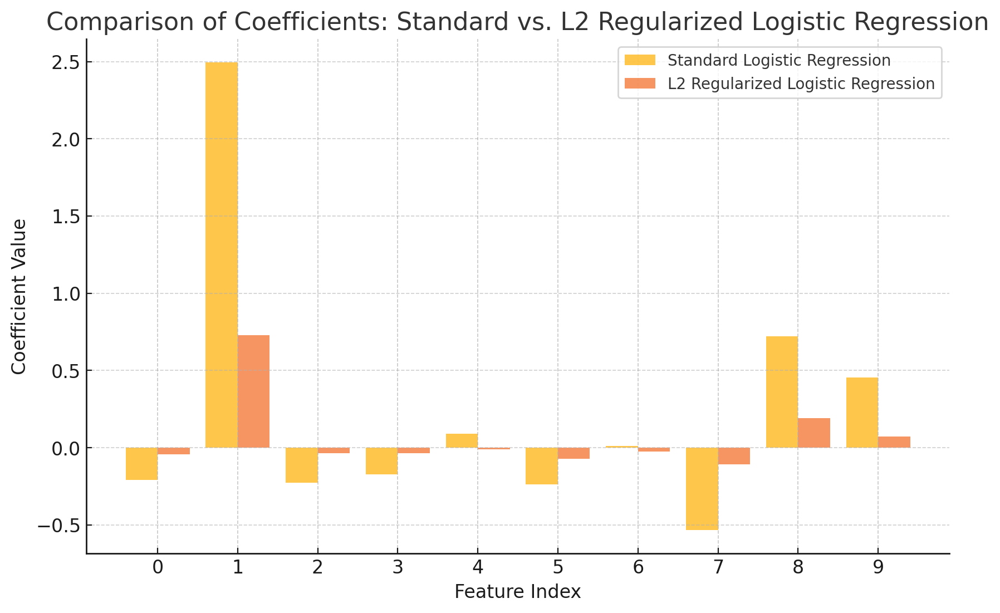

## 线性回归

### **目标**
用于预测**连续变量**（如房价、气温等）。

### **数学公式**
$$
y = \beta_0 + \sum_{j=1}^{p} \beta_j x_j + \epsilon
$$

这里 $y$ 是连续值预测目标，$x_j$ 是特征，$\beta_j$ 是回归系数，$\epsilon$ 是误差项。

### **损失函数**
$$
L(\beta) = \frac{1}{n} \sum_{i=1}^{n} (y_i - \hat{y}_i)^2
$$

### **特点**
- 适用于回归任务，预测连续变量。
- 使用最小二乘法（OLS）或梯度下降优化。
- 对异常值敏感，可能需要正则化处理。


## 逻辑回归

### **目标**
用于**二分类任务**（如判断“是否患病”）。

### **数学公式**
$$
\sigma(z) = \frac{1}{1 + e^{-z}}, \quad z = \beta_0 + \sum_{j=1}^{p} \beta_j x_j
$$

- 这里 **$\sigma(z)$** 是**sigmoid 函数**，用于将线性回归结果压缩到 (0,1) 范围，作为**类别概率**。

### **损失函数**
$$
L(\beta) = -\sum_{i=1}^{n} \left[y_i \ln \sigma(z_i) + (1 - y_i) \ln (1 - \sigma(z_i))\right]
$$

### **特点**
- 适用于二分类问题（如垃圾邮件分类）。
- 目标是最大化似然函数。
- 采用梯度下降（如 SGD，Adam）优化。


## 带正则项的逻辑回归

### **目标**
在逻辑回归的基础上**增加正则化项**，防止过拟合。

### **数学公式**
$$
L(\beta_0, \beta) = penalty(\beta) + \frac{\lambda}{n} \sum_{i=1}^{n} \left[y_i \ln \sigma(z_i) + (1 - y_i) \ln (1 - \sigma(z_i))\right]
$$

### **正则项（Penalty）**
- **L1 正则化（Lasso）**: $||\beta||_1$ → 使部分特征权重变为 0（用于特征选择）。
- **L2 正则化（Ridge）**: $||\beta||^2_2$ → 使权重整体变小（防止过拟合）。

### **特点**
- 适用于高维数据，防止过拟合。
- L1 用于特征选择，L2 用于稳定参数。
- 超参数 λ 控制正则化强度。


## 关键区别总结

| **模型** | **目标** | **输出类型** | **损失函数** | **正则化** | **应用场景** |
|---|---|---|---|---|---|
| 线性回归 | 预测连续值 | 实数（回归） | MSE（均方误差） | 无 / L1 / L2 | 价格预测、温度预测等 |
| 逻辑回归 | 预测类别概率 | 概率值（0~1） | 交叉熵损失 | 无 | 二分类任务，如垃圾邮件检测 |
| 带正则项逻辑回归 | 防止过拟合 | 概率值（0~1） | 交叉熵损失 | L1 / L2 | 高维数据分类任务 |


## 代码示例

用 `sklearn` 比较 **标准逻辑回归** 和 **带 L2 正则化的逻辑回归**：

```python
import numpy as np
import matplotlib.pyplot as plt
from sklearn.linear_model import LogisticRegression
from sklearn.datasets import make_classification
from sklearn.model_selection import train_test_split

X, y = make_classification(n_samples=500, n_features=10, random_state=42)
X_train, X_test, y_train, y_test = train_test_split(X, y, test_size=0.3, random_state=42)

# 训练标准逻辑回归 无正则化
model_standard = LogisticRegression(penalty='none', solver='lbfgs', max_iter=1000)
model_standard.fit(X_train, y_train)

# 训练带 L2 正则化的逻辑回归 C=0.01
model_l2 = LogisticRegression(penalty='l2', C=0.01, solver='lbfgs', max_iter=1000) # 更强的L2约束
model_l2.fit(X_train, y_train)

# 提取权重参数
standard_coef = model_standard.coef_[0]
l2_coef = model_l2.coef_[0]

features = np.arange(len(standard_coef))

plt.figure(figsize=(10, 6))
plt.bar(features - 0.2, standard_coef, width=0.4, label="Standard Logistic Regression", alpha=0.7)
plt.bar(features + 0.2, l2_coef, width=0.4, label="L2 Regularized Logistic Regression", alpha=0.7)

plt.xlabel("Feature Index")
plt.ylabel("Coefficient Value")
plt.title("Comparison of Coefficients: Standard vs. L2 Regularized Logistic Regression")
plt.xticks(features)
plt.legend()
plt.grid(axis="y", linestyle="--", alpha=0.6)

plt.show()
```




### **结果分析**
- **标准逻辑回归的参数（coefficients）会较大**，如果特征相关性强，可能有一些特征的权重大幅波动。
- **带 L2 正则化的逻辑回归的参数较小且更加平稳**，不会有极端的权重值。

## 结论

- **如果是回归任务（预测连续值）** → 线性回归。
- **如果是二分类任务（0/1 分类）** → 逻辑回归。
- **如果是高维分类任务，防止过拟合** → 带正则项的逻辑回归。
